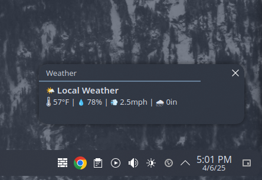

# KDE Weather Notifier 🌤

A lightweight KDE-friendly weather popup using data from your personal Ambient Weather station.



## Features

- Fetches live weather data from Ambient Weather API
- Shows desktop notifications via `notify-send`
- Clickable `.desktop` launcher


## Setup

1. Clone the repo
2. Create `weatherapp/config.py` with:

```python
API_KEY = 'your_api_key'
APP_KEY = 'your_app_key'
MAC_ADDRESS = 'your_mac_address'
